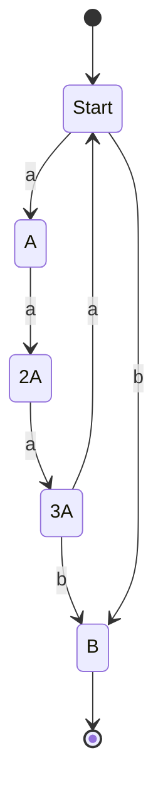
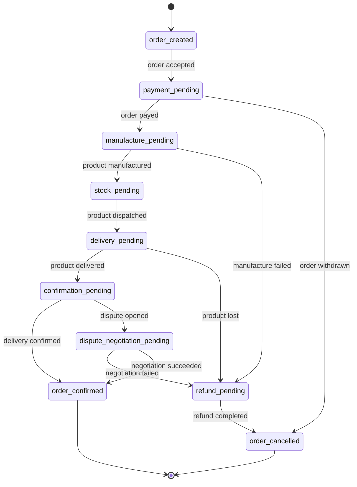

# Enums workshop

## Intro

### Enumeration

Special class, that represents a group of 'constants'.
```java
enum Weather {
    SUNNY, CLOUDY, RAINY, SNOWY, WINDY
}
//....
for(Weather w: Weather.values()) {
    System.out.println(w);
}
```

Can have fields and methods.
Can't extend other classes, but can implement interfaces.

#### Tasks
A washmachine can operate on 3 heat levels, with 3 different color programs. Examine the behaviour of the program in package `com.codecool.enums.task1`!

1. What happens when the current implementation is called with invalid values? How would the caller know?
2. Implement a solution in `task2`, without enums, how could this be fixed? (hint: think constants, with private constructors)
3. Implement a solution in `task3`, with enums!


## State machine with enums

### State Machines

A finite state machine is a mathematical abstraction used to design algorithms.

A state machine will read a series of inputs. When it reads an input, it will switch to a different state.
Each state specifies which state to switch to, for a given input.

Can be represented by a graph, or a state transition table.

#### Tasks

4. Create a java program, that implements below state machine:


5. [Extra] Create a java program, that implements below state machine:


[Examples](https://gamedevelopment.tutsplus.com/tutorials/finite-state-machines-theory-and-implementation--gamedev-11867)